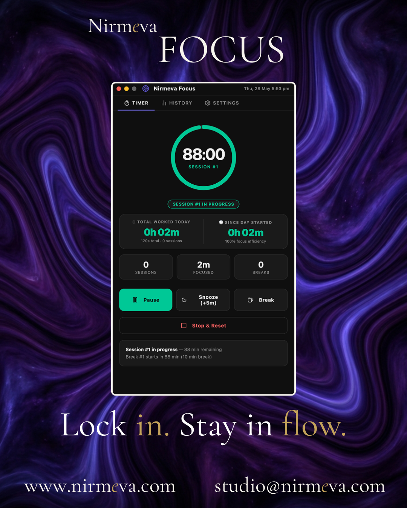
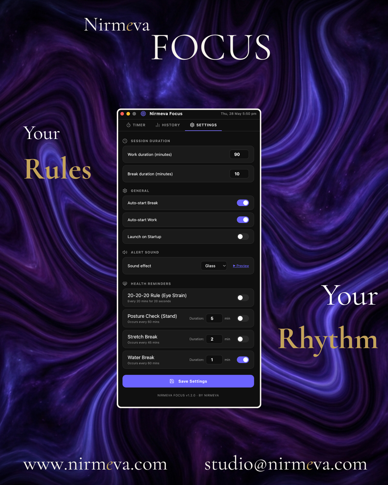
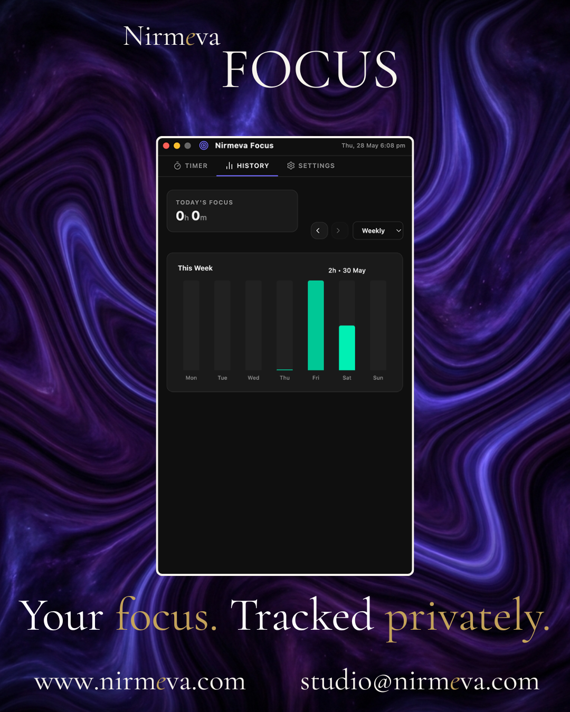
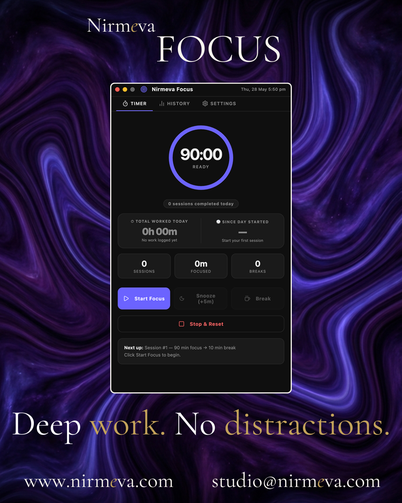

# Nirmeva Focus

> A macOS productivity app for deep work — lives in your menu bar, works everywhere.

| | | |
|---|---|---|
|  |  |  |

---

## What is Nirmeva Focus?

Nirmeva Focus is a macOS productivity app that sits in your menu bar and manages your entire work day — focus sessions, breaks, health reminders, and analytics — without ever cluttering your Dock or Desktop.

Click the menu bar icon to open a full dashboard. Right-click for instant controls without opening anything.

---

## Features

- **Menu bar app** — no Dock icon, no distractions
- **Full dashboard** — live countdown ring, session tracker, efficiency score
- **Pomodoro-style sessions** with automatic full-screen break overlays
- **5-second break countdown** — forces you to actually step away
- **Health reminders** — 20-20-20 eye strain, posture check, stretch break, water break
- **Intelligent break stacking** — multiple reminders combine into one micro-break
- **Right-click menu bar control** — pause, skip, or check status without opening the app
- **Offline analytics** — weekly and monthly focus history charts
- **100% private** — no account, no internet, no tracking
- **Free**

---

## Screenshots

 

 

---

## Download

### Homebrew (Recommended)

Installs cleanly with no macOS security warnings:

```bash
brew install --cask nirmeva-studio/tap/nirmeva-focus
```

### Manual DMG

1. Download the latest `.dmg` from [Releases](https://github.com/Nirmeva-Studio/nirmeva-products/releases)
2. Open the `.dmg` and drag **Nirmeva Focus** to your Applications folder
3. Open Terminal and run this once to bypass the macOS security block:

```bash
xattr -cr /Applications/Nirmeva\ Focus.app
```

4. Launch **Nirmeva Focus** from Applications

---

## How It Works

1. **Start Focus** — hit Start, the session begins counting down in your menu bar
2. **Stay in control** — Pause, Snooze (+5 min), or take an Early Break anytime
3. **Break time** — a full-screen overlay triggers automatically when your session ends
4. **Health reminders** — auto-pause the timer and prompt you to rest, stretch, or hydrate
5. **Review your day** — open History to see your weekly and monthly focus charts

---

## Health Reminders

| Reminder | Interval | Duration |
|---|---|---|
| 20-20-20 Eye Strain | Every 20 minutes | 20 seconds |
| Posture Check | Every 60 minutes | Configurable |
| Stretch Break | Every 45 minutes | Configurable |
| Water Break | Every 60 minutes | Configurable |

All reminders are optional and toggled individually in Settings.

---

## Requirements

- macOS 10.12 (Sierra) or later
- Apple Silicon — M1 / M2 / M3 / M4

---

## Links

- [Product Page](https://product.nirmeva.com/nirmeva-focus)
- [Release Notes](https://github.com/Nirmeva-Studio/nirmeva-products/releases)
- [Report a Bug](https://github.com/Nirmeva-Studio/nirmeva-focus/issues)

---

Built by [Nirmeva Studio](https://www.nirmeva.com) · [studio@nirmeva.com](mailto:studio@nirmeva.com)
